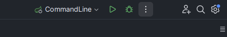
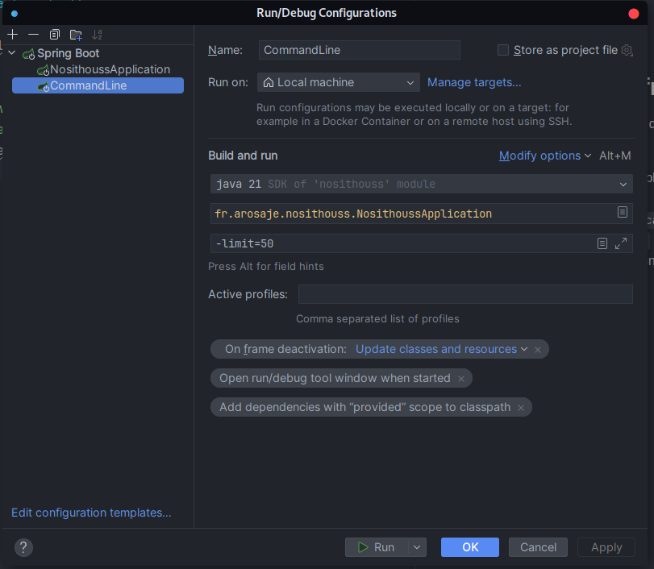

# Nosithous

## Livrable

---

### Swagger

Tout nos endpoint sont documenté via la docApi grâce à swagger-ui disponnible à cet url (Veuillez à lancer l'application
au préalable soit via le container soit via votre IDE): [Swagger](http://localhost:8080/swagger-ui/index.html#/)

Vous y trouverai les schemas de réponse, les attendu en paramétre, une description de l'endpoint

## Toolbox - DEV

---

## ETL - extract data from trefle.io

L'ETL permet de remplir sa base de donnée via l'api de trefle.io, voici les étapes pour le lancer:

- Dans votre fichier ressource/application.yml modifier ces chap de cette façon;
    - ``spring.main.web-application-type: none``
    - ``spring.main.etl: true``
- Sur intellij, editez la configuration de lancement de votre application (clique droit sur les trois petit points +
  edit):

- Et ajoutez une nouvelle configuration de la sorte, la limite correspond au nombre de poste que vous voulez extraire (
  si vous ne specifiez pas de limite ou qu'elle est inferieur ou egale à zéro, le programme récupéreras toute les donnée
  de trefle.io). Tapez ``alt+R`` pour avoir le champ argument de programme,
  sinon: ``Modify options -> 'Java' -> Program arguments``:

### Note

Pour revenir à une configuration serverlet de base, il suffit juste de remplacer ces champs dans votre fichier
ressource/application.yml:

- ``spring.main.web-application-type: none``
- ``spring.main.etl: true``
