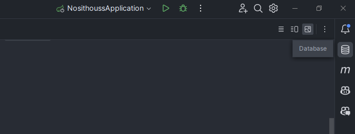
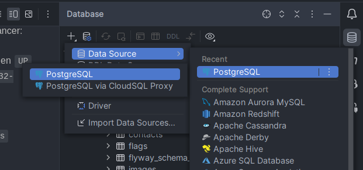
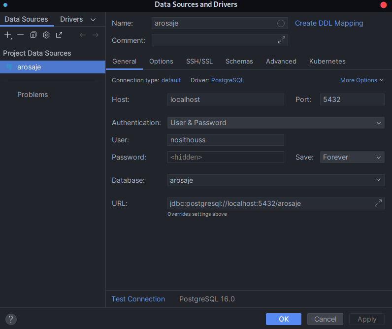
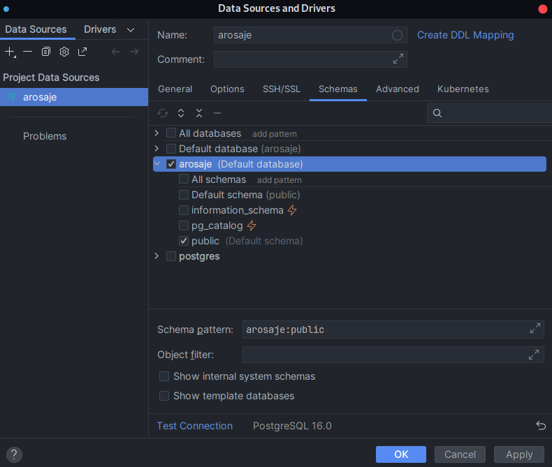
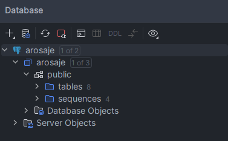

# Docker

# BDD - postgres

Lancer la base de donnée postgres avec docker-compose:

### Prérequis

- docker, docker-compose ou docker Desktop, avoir une connexion internet, avoir les droit administrateur de sa machine,
  quelques notions en français

### Procédure

- Ce rendre dans le dossier docker du projet:
    - ```cd docker/```
- Executé le fichier docker-compose-pg.yml avec docker compose:
    - ```docker-compose -f docker-compose-pg.yml up -d```
- Verifier que le conteneur est bien lancer:
    - ``docker container ls -a``
        - Verifier le conteneur est bien ``UP`` avec le port ``0.0.0.0:5432->5432/tcp`` avec le nom ``mspr_java``
    - ``docker image ls -a``
        - le repertoire est ``postgres``, tag: ``lastest``

### En cas d'erreur

- Stopper tout les autre conteneur:
    - ``docker stop mon_conteneur``
- Vérifier qu'une autre image de postgres n'existe pas déjà, dans le doute, on la supprime...
    - ``docker image rm image_id``
- Vérifier que postgres n'est pas lancé, si c'est le cas on le stop:
    - ``systemctl stop postgresql``
- Vérifier que le port n'est pas déjà utilisé pas un autre process si c'est le cas, on stop
    - ``lsof -i :5432``

En cas d'erreur, il faut supprimer le coteneur et son image (mspr_java et postgres_java) et refaire la procedure.

### Ce connecter

Ce rendre sur l'icone database de son intellij:



Cliquer sur le "+" pour ajouter une datasource, selectionner postgres:



L'url de connection est: ``jdbc:postgresql://localhost:5432/arosaje``, les credential ce trouve dans le
fichier ``docker-compose-pg.yml``



S'assurer que les bons schemas sont séléctionnés (se rendre dans l'onglet scheams):



Vous devriez avoir ce resultat, si vous n'avez pas lancé le back, le nombre de table doit être different:



# Nosithouss - app java servlet

Lancer l'application java nosithouss en mode serveur web

### Prérequis

- docker, docker-compose ou docker Desktop
- Connexion internet
- Droit administrateur de sa machine
- Aucun service n'utilise le port (Ne pas lancer l'application avec intellij)

### Procédure

- IL faut tout d'abords créer un dossier data-nosithouss/ dans votre dossier docker/ notre conteneur pourras aller lire
  dedans
- Déployez votre projet afin de récupérer votre fichier .jar, à la racine du projet: ``mvn clean install``
- Récupérez ce fichier ``./target/nosithouss.jar`` fraichement creer et copier le dans votre
  docssier ``./docker/data-noithouss/`` sous le nom de`` nosithouss.jar``, sous
  linux: ``sudo cp ./target/nosithouss-0.0.1.jar ./docker/data-nosithouss/nosithouss.jar``
- Plus qu'a lancer votre docker container: ``docker-compose -f docker-compose-nosithouss up -d``
- Petire verification: ``docker ps -a``, le resultat attendu est:
    - ``fc4da229f3a3 // openjdk:21 // "java -jar /app/nosi…" // 8 minutes ago // UP // nosithouss``

### En cas d'erreur

- Analyser les logs du conaitner: ``docker logs nosithouss``
- Vérifier que le port n'est pas déjà utilisé pas un autre process si c'est le cas, on stop: ``lsof -i :8080``
- Vérifiez les profile: ``./ressources/application.ym``, ``./ressources/application-dev.ym``, ``./ressources/application-prod.ym``